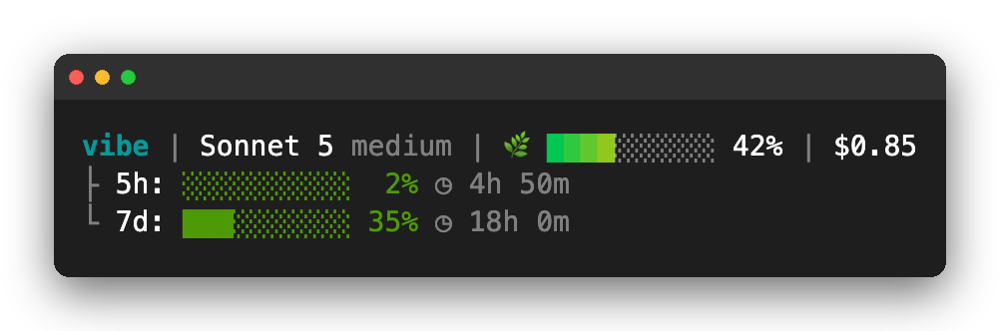
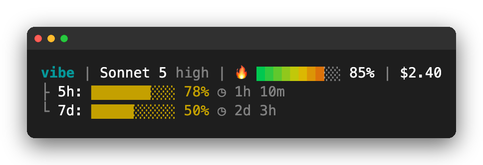
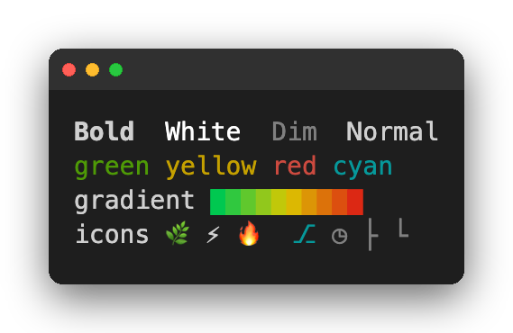

# claude-statusline

A curated, good-looking statusline for [Claude Code](https://claude.com/claude-code) — plus a guided skill to customize it in plain English.



A truecolor gradient context bar, live rate-limit countdowns, git branch/worktree, model, effort, and session cost — all in one always-visible bar below your prompt.

As context fills, the bar shifts green → yellow → red and the icon escalates 🌿 → ⚡ → 🔥:



---

## Install

Three ways, depending on whether you want to customize.

### Option 0 — paste a prompt to Claude Code

Already chatting with Claude Code? Skip the terminal — paste this in and it'll explain the two options below, ask which you want, then install it for you:

```text
Set up claude-statusline for me (https://github.com/krittintrs/claude-statusline).

First explain, in 1-2 sentences each, the two install options:
- Default: the curated statusline as-is, fast, no customization.
- Skill: the same default, plus a /statusline-setup skill so I can customize fields
  and display styles in plain English later.

Then ask which I want, and do it:
- Default → curl -fsSL https://raw.githubusercontent.com/krittintrs/claude-statusline/main/install.sh | bash
- Skill → npx skills@latest add krittintrs/claude-statusline, then tell me to run
  /statusline-setup next session.

Confirm when done and tell me how to verify the statusline is showing.
```

### Option 1 — the skill (guided & customizable)

Install the setup skill with [`npx skills`](https://github.com/vercel-labs/skills):

```bash
npx skills@latest add krittintrs/claude-statusline
```

Then in Claude Code, run:

```
/statusline-setup
```

The skill installs the statusline for you and walks you through any changes in plain English — see your current bar, browse every field and style, preview live, and write only when you're happy. Best if you want to tweak the design.

→ see [Using the skill](#using-the-skill) below for how to customize it.

### Option 2 — one-liner (just the default, fast)

```bash
curl -fsSL https://raw.githubusercontent.com/krittintrs/claude-statusline/main/install.sh | bash
```

Downloads `statusline.sh` to `~/.claude/`, backs up and patches `settings.json`, done. Restart Claude Code (or send a prompt) to see it.

→ see [Using the skill](#using-the-skill) below — you can add it anytime, the default doesn't lock you out of customizing later.

**Requirements:** `jq` (recommended) or `python3`. The script falls back gracefully. On Windows, run inside **Git Bash** — Claude Code executes the statusline through it.

---

## What it shows

| Segment | Example | Notes |
|---------|---------|-------|
| Repo / dir | `vibe` | Bold cyan; from `repo.name` or folder |
| Git branch | `⎇ main` | Dim cyan; truncates on narrow terminals |
| Git worktree | `[wt: feat-ui]` | Only when inside a linked worktree |
| Model + effort | `Sonnet 5 medium` | |
| Context usage | `🌿 ████░░░░░░ 42%` | Gradient bar + 🌿/⚡/🔥 health icon |
| Session cost | `$0.85` | |
| 5h / 7d rate limits | `5h: ░░░░░░░░░░ 2% ◷ 4h 50m` | Bar + countdown (Pro/Max only) |

---

## The design choices



This isn't a kitchen-sink widget dump — every choice is deliberate:

- **Gradient context bar** carries the "how full am I" signal by color *and* icon, so no label is needed — 🌿 under 50%, ⚡ 50–79%, 🔥 80%+.
- **White labels, colored values.** Rate-limit labels (`5h:` `7d:`) stay white and stable; only the bar and percent take threshold color (green → yellow → red). The row signals danger without screaming.
- **Tree-prefixed rate limits** (`├` `└`) on their own lines keep line 1 clean and scannable.
- **Same-hue dir + branch** (bold cyan + dim cyan) reads as one "location" unit without adding a competing color.
- **Space-padded percent** so the reset clock always aligns across rows.
- **`refreshInterval: 60`** keeps countdowns ticking even when the session is idle.

---

## Using the skill

If you installed the skill (Option 1), just run `/statusline-setup` and describe what you want in plain English — *"remove cost"*, *"plain text instead of the gradient"*, *"add PR number"*, *"rate limits on one line"*. It previews each change live and writes only when you confirm.

Already installed the default via Option 2? Add the skill anytime:

```bash
npx skills@latest add krittintrs/claude-statusline
```

What you can change:

- [Available fields](skills/statusline-setup/fields-ref.md) — everything you can show
- [Display styles](skills/statusline-setup/styles-ref.md) — every way to show it

---

## Manual install

If you'd rather not pipe to bash:

1. Copy `statusline.sh` to `~/.claude/statusline.sh` and `chmod +x` it.
2. Add to `~/.claude/settings.json`:
   ```json
   "statusLine": {
     "type": "command",
     "command": "~/.claude/statusline.sh",
     "refreshInterval": 60
   }
   ```
3. Restart Claude Code.

---

## Credits

Inspired by the Claude Code statusline ecosystem — [ccstatusline](https://github.com/sirmalloc/ccstatusline), [claude-statusline-powerline](https://github.com/spences10/claude-statusline-powerline), and the [official docs](https://code.claude.com/docs/en/statusline).

## License

MIT
